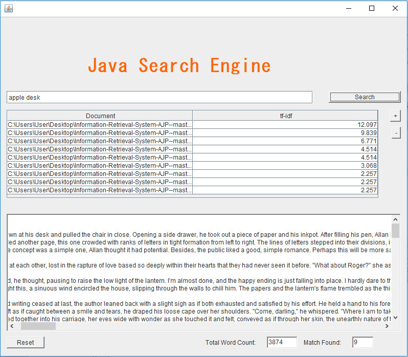

# Information-Retrieval-System-AJP-
## Summary
A simple information retrieval system that ranks the documents based on the relevant words that are found 
from the user search query. tf-idf, short for term-frequency-inverse document frequency, is the formula used to calculate
the imporance of a word is to a document in the collection

## Features
Below are the functionalities that were implemented in the appilication.

1.Loading in all the text document information from all the files. A set of files from Open American National Corpus is used for testing in this assignment.

2.Pre-process each text document to do the relevant word counts, storing the data in hashmaps(one hashmap for one text document) for fast retrieval during the analysis
phase.

3.Provide a menu for user to enter the search query terms, and then calculate the td-idf score for each text document. 
For example if user enters query term, “Singapore attraction” then the document will have a td-idf score which is the sum of td-idf of Singapore + td-idf of attraction

4.Display the top 10 query search documents with the score information. To make use of Comparable interface to do sorting

## Application Interface

